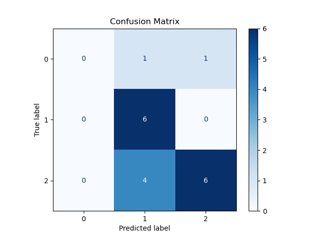

# Training with Custom Datasets

This repository is a deep learning pipeline for classifying screenshots with advanced data augmentation using PyTorch and Albumentations. The project leverages transfer learning on Google's GoogLeNet to achieve high accuracy with minimal training data.


## Features

- **Custom Dataset Handling:** Supports CSV-based annotation for screenshots.
- **Data Augmentation:** Powered by Albumentations to enrich training data.
- **Transfer Learning:** Fine-tuning GoogLeNet with frozen layers.
- **Visualization:** Includes tools for augmentations, training metrics, and confusion matrix plotting.


## Installation

Clone this repository to your local machine:
```bash
git clone https://github.com/cxycode32/Training-With-Custom-Datasets.git
cd Training-With-Custom-Datasets
```

Install the required dependencies:
```bash
pip install -r requirements.txt
```


## Usage

Run the training script with default parameters:
```bash
python main.py
```


### File Structure
```
├── main.py                # Training script
├── dataset.py             # Custom dataset class
├── utils.py               # Utility functions
├── your_datasets/         # Your images
├── data_labels.csv        # CSV file with image labels
├── best_model.pth         # Saved best model
├── requirements.txt       # Project dependencies
└── .gitignore             # Ignored files for Git
```

## Visualization

### Training Loss and Accuracy

The training loss and accuracy.


### Confusion Matrix




## Contribution

Feel free to fork this repository and submit pull requests to improve the project or add new features.


## License

This project is licensed under the MIT License.