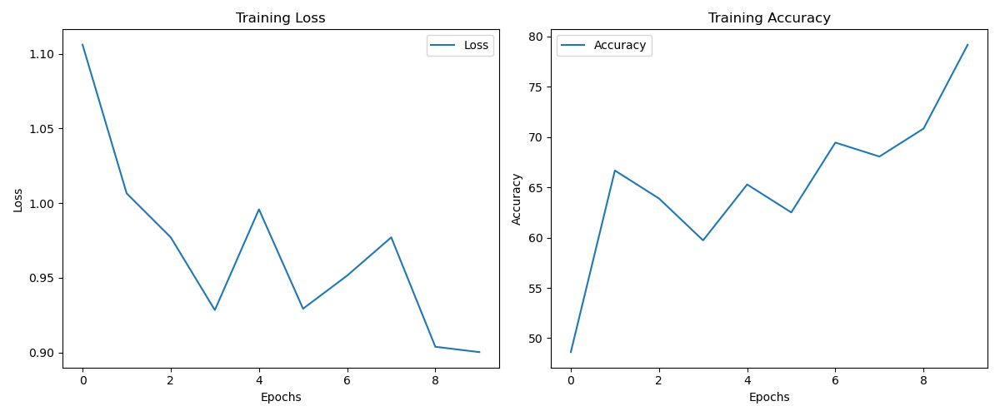

# Train Custom Classification Model

This repository provides a framework for training a **custom image classification model** using **GoogLeNet** with **PyTorch**. You can train your model on your own dataset, experiment with different hyperparameters, and visualize training progress using TensorBoard.

---

## 🚀 Features

- **Custom Training** – Train your model on any dataset structured in labeled folders.
- **Hyperparameter Tuning** – Experiment with different batch sizes and learning rates.
- **Handling Imbalanced Datasets** – Adjust class weights automatically for better training.
- **Complete Workflow** – Load data, train, validate, test, and save your model.
- **Visualization** – Monitor training progress with TensorBoard.

---

## Installation

1. Clone this repository:
```bash
git clone https://github.com/cxycode32/Train-Custom-Classification-Model.git
cd Train-Custom-Classification-Model/
```

2. Install the required dependencies:
```bash
pip install -r requirements.txt
```

### Project Structure
```
├── main.py                # Main training script
├── utils.py               # Utility functions (checkpointing, transforms, etc.)
├── config.py              # Configuration file (hyperparameters, paths)
├── dataset.py             # Custom dataset class for loading images
├── datasets/              # Folder to store your custom dataset
├── dataset.csv            # CSV file mapping images to labels
├── requirements.txt       # Project dependencies
└── .gitignore             # Ignored files for Git
```

### Dataset Structure
Your dataset should be organized into labeled directories:
```
datasets/
  ├── class1/
  │   ├── image1.jpg
  │   ├── image2.jpg
  │   └── ...
  ├── class2/
  │   ├── image1.jpg
  │   ├── image2.jpg
  │   └── ...
  └── ...
```
A CSV file named **dataset.csv** should contain the mapping of filenames to their corresponding labels.


## Usage

Run the training script with default settings:
```bash
python main.py
```


## Visualization

### TensorBoard

Monitor training loss and accuracy in real-time:
```bash
tensorboard --logdir=runs
```

### Training Loss and Accuracy

The training loss and accuracy.




## Contribution

Feel free to fork this repository and submit pull requests to improve the project or add new features.


## License

This project is licensed under the MIT License.