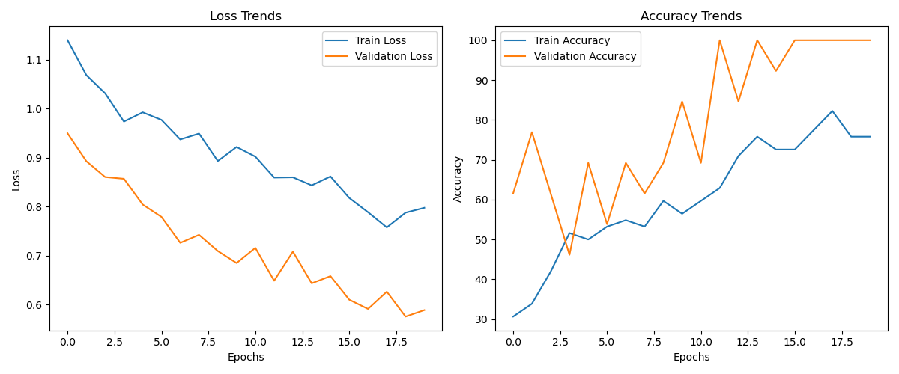

# Train Custom Classification Model

This repository is about training your own classification model based on the GoogLeNet architecture with your own custom dataset using PyTorch.


## Features

- You can experiment with different batch sizes and learning rates to find out which combination works best for you.
- Help you adjust weights for imbalanced dataset.
- You can load, train, validate, test, and save your model.
- Visualization using TensorBoard.


## Installation

Clone this repository:
```bash
git clone https://github.com/cxycode32/Train-Custom-Classification-Model.git
cd Train-Custom-Classification-Model/
```

Install the required dependencies:
```bash
pip install -r requirements.txt
```


### Project Structure
```
├── main.py                # Training script
├── utils.py               # Utility functions
├── config.py              # Configuration
├── dataset.py             # Custom dataset class
├── datasets/              # Your custom dataset
├── dataset.csv            # CSV file with image labels
├── requirements.txt       # Project dependencies
└── .gitignore             # Ignored files for Git
```


### Dataset Structure
```
datasets/
  ├── class1/
  │   ├── image1.jpg
  │   ├── image2.jpg
  │   └── ...
  ├── class2/
  │   ├── image1.jpg
  │   ├── image2.jpg
  │   └── ...
  └── ...

```
A CSV file named **dataset.csv** should contain the mapping of filenames to their corresponding labels.


## Usage

Run the training script with default parameters:
```bash
python main.py
```


## Visualization

### Training Loss and Accuracy

The training loss and accuracy.




## Contribution

Feel free to fork this repository and submit pull requests to improve the project or add new features.


## License

This project is licensed under the MIT License.